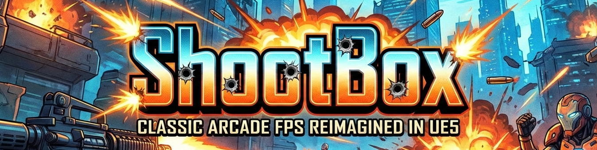
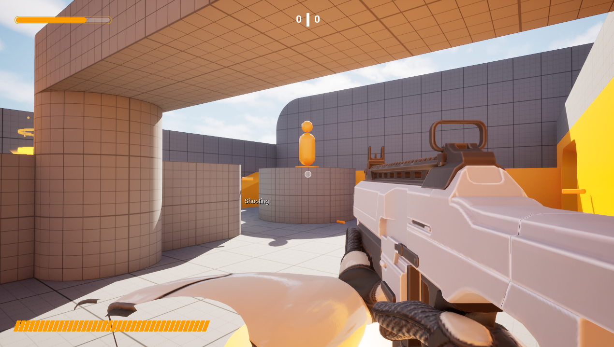

# ShootBox

<p align="center">
  
</p>

<p align="center">
  <strong>UE5 기반 1인칭 슈팅 게임</strong>
</p>

<p align="center">
  
  
  
</p>

---

## 🎮 게임 소개

> 클래식 아케이드 FPS의 현대적 재해석

빠른 템포의 전투와 직관적인 조작감을 목표로 합니다.

<p align="center">
  
</p>

---

## 📁 프로젝트 구조

```
ShootBox/
├── Content/
│   ├── Blueprints/      # 블루프린트
│   ├── Maps/            # 레벨
│   ├── UI/              # 위젯
│   └── Characters/      # 캐릭터 에셋
├── Source/              # C++ 소스
└── README.md
```

---

## 📅 개발 기간

**2026.01 ~ 2026.02** (약 4주)

---

## 👨‍💻 개발자

<table>
  <tr>
    <td align="center">
      <strong>이름</strong><br>
      기획 · 프로그래밍<br><br>
      <a href="https://github.com/username">
        
      </a>
      <a href="mailto:email@example.com">
        
      </a>
    </td>
  </tr>
</table>

---

## 주요 기능

### 로코모션
- **달리기** — Shift를 누르면 빠르게 이동
- **조준 이동** — 조준 중에는 느리지만 정확하게 이동

### 전투
- **조준 (ADS)** — 우클릭으로 정밀 조준, FOV 변경
- **재장전** — R키로 재장전, 탄창 30발
- **체력 시스템** — HUD에 실시간 표시, 피격 시 화면 효과

### AI
- **적 순찰** — 지정된 경로를 순찰
- **적 추적** — 플레이어 발견 시 추적 및 공격

---

## 조작법

| 키 | 동작 |
|:---:|------|
| `WASD` | 이동 |
| `Shift` | 달리기 |
| `Mouse` | 시점 이동 |
| `좌클릭` | 발사 |
| `우클릭` | 조준 (ADS) |
| `R` | 재장전 |

---

## 설치 및 실행

### 요구 사항
- Unreal Engine 5.5 이상
- Windows 10/11

### 실행 방법
```bash
1. ShootBox.uproject 파일 더블클릭하여 에디터 실행
2. Play 버튼 클릭
```